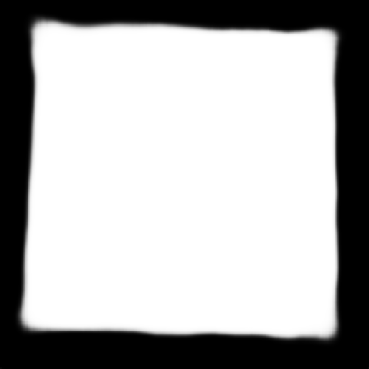
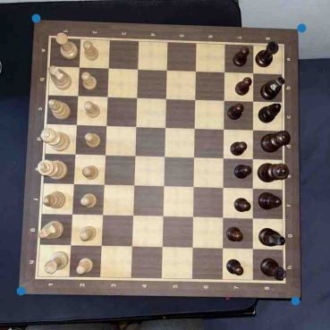
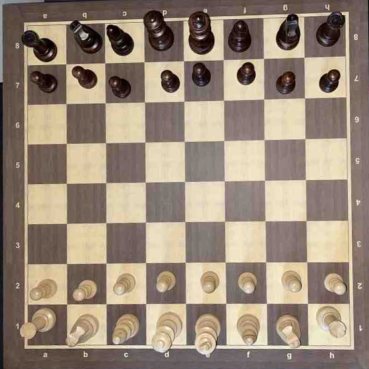
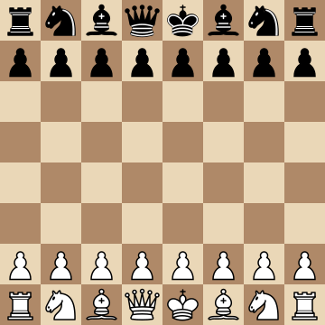

# Digital Chessboard Mapper

During many chess tournaments, expensive electronic chessboards are used to broadcast and analyse live games. This project uses machine learning to avoid the acquisition
of such chessboards. The devised programme uses three convolutional neural networks (CNN) to recognise a real chessboard from a video transmission and highlight it (Chessboard Highlighter), to locate the four corners of the chessboard, so that the 64 squares can be precisely extracted (Corner Detector) and, finally, to recognise the piece on each square (Piece Classifier). This determines the current position of the chessboard in Forsyth-Edwards Notation (FEN). With this notation, it is possible to visualise the position within a virtual chessboard.

## Table of Contents

- [Features](#features)
- [Screenshots/Demo](#screenshots-demo)

## Features

- Chessboard highlighter: Convolutional Neural Network (CNN) that generates a chessboard mask from a real chessboard image;
- Corner detector: CNN that extracts the coordinates of the four chessboard corners from a chessboard mask;
- Piece classifier: CNN that classifies square images into the following categories: empty square, white pawn, white knight, white bishop, white rook, white queen, white king, black pawn, black knight, black bishop, black rook, black queen, and black king.

## Screenshots/Demo

[Watch a Real-Time Video Application Showcase](https://youtu.be/ZVWDbiI0f2M)

1. Image of a chessboard taken as input.
   
   

2. Mask of the generated chessboard.
   
   

3. Predicted corners of the chessboard.
   
   

4. Perspective transformed and rotated image.
   
   
   
5. Extracted squares.
    
   

6. Predicted chessboard.
   
   
